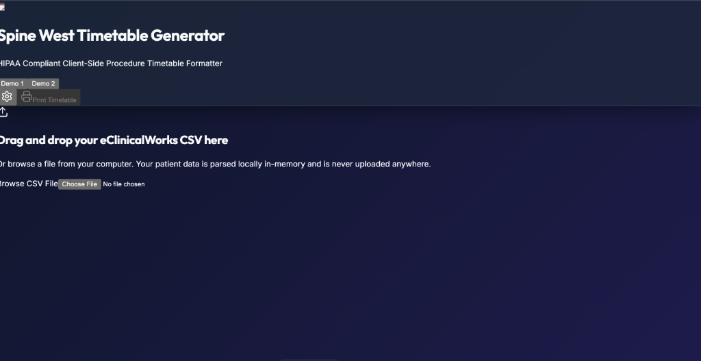
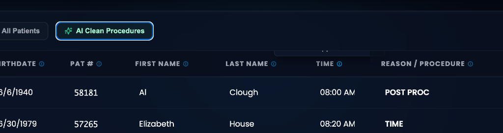

# SPINE WEST • ProcFlow

[](https://vercel.com/)
[](https://react.dev/)
[](https://vitejs.dev/)
[](https://www.hhs.gov/hipaa/index.html)

**ProcFlow** is a clinical-grade, highly optimized client-side scheduler normalizer built specifically for **Spine West**. It bridges the gap between raw eClinicalWorks demographic CSV rosters and high-fidelity, printable clinical landscape timetables.

Developed for doctors and nursing staff, ProcFlow uses a high-performance in-memory parser paired with an intelligent medical scribe engine to format patient appointments into perfectly structured landscape timetables.

*Developed by **bo** (https://www.boresearcher.com/).*

---

## 📸 Interface Previews

### 1. Secure System Access Gateway
A clean, vertically centered portal designed with smooth glassmorphism and real-time credential validation.


### 2. Clinical Dashboard (Dark Mode)
The default dark interface providing deep navy clinical aesthetics, inline CSV drag-and-drop parser, and dynamic grid operations.


### 3. Clinical Dashboard (Light Mode)
A clean, soft gray medical theme tailored for high-glare environments.


### 4. Read-Only System Configuration
Masked OpenAI API key viewer featuring a show/hide toggle.


---

## ⚡ Core Pillars

### 🔐 100% HIPAA Compliance (Safe & Local)
Patient privacy is our highest priority. ProcFlow runs entirely in-memory (RAM) on the client browser:
* **No Database**: Appointments are parsed, cached in-memory, and formatted without touching a database.
* **No Server Storage**: Zero patient data is ever transmitted, serialized, or stored on remote servers.
* **Immediate Purge**: Refreshing or closing the tab instantly purges all temporary memory states.

### 🧠 Intelligent Scribe Engine
ProcFlow automatically normalizes complex shorthand medical jargon and abbreviations directly upon import:
* Normalizes codes (e.g. shorthand terms like `*LIESI` -> `L3-4 ILESI`, `*CMBB` -> `L4-5 CMBB`) into standard clinical descriptions.
* Leverages high-performance chat completion engines configured with strict non-retention policies.

### 📐 Rotated landscape Timetable Print Engine
Prints directly to physical sheets matching the rotated 180° layout of the clinic's standard template:
* Generates clear, high-contrast, black-bordered grids.
* Configures automatic page breaks and excludes browser headers/footers automatically.
* Operates in standard US-Letter Landscape orientation.

### 🎛️ Interactive Data Grid
Provides schedulers complete control before exporting:
* **Real-time Filter**: Instant search bar to filter by patient name, chart ID, or procedure.
* **Include/Exclude Toggle**: Choose which patients are printed in the final timetable.
* **Editable Fields**: Click and edit values directly within the grid in real-time.
* **Dynamic Row Operations**: Easily add manual appointment lines or delete outdated rows.

---

## ⚙️ Local Development Setup

To run this project locally, follow these steps:

### Prerequisites
* Node.js (version 18 or higher)
* npm (Node Package Manager)

### Installation
1. Clone the repository:
   ```bash
   git clone git@github.com:boreddy114/Procflow.git
   cd Procflow
   ```

2. Install dependencies:
   ```bash
   npm install
   ```

3. Launch the development server:
   ```bash
   npm run dev
   ```

4. Build production bundle:
   ```bash
   npm run build
   ```

---

## 🏢 Clinic Details
**Spine West**  
Spine, Orthopedic & Regenerative Medicine  
5387 Manhattan Circle, Boulder, CO 80303  
*Ph: 303-494-7773*  
*Website: [https://www.spinewest.com/](https://www.spinewest.com/)*
